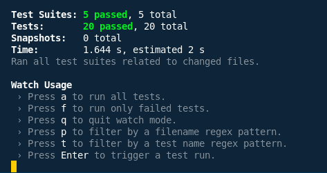
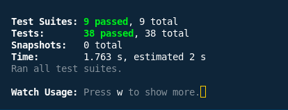

# Assignment 1: Unit & Integration Testing with Coverage Analysis

## Introduction

This document outlines the testing strategy and outcomes for Assignment 1, focusing on the RealWorld application's backend (Go/Gin) and frontend (React/Redux). The assignment involved designing and executing unit and integration tests, evaluating code coverage, and summarizing the process and findings.

---

## Testing Methodology

### Backend (Go/Gin)

- **Unit Tests:**  
  - Reviewed existing tests in the `common/` and `users/` directories.
  - Developed extensive unit tests for the `articles/` package, targeting models, serializers, and validators.
  - Expanded `common/unit_test.go` to include more scenarios for JWT, database operations, and utility functions.

- **Integration Tests:**  
  - Built comprehensive API tests in `integration_test.go` to verify authentication, article CRUD operations, and article interactions (favorites, comments).

- **Coverage Evaluation:**  
  - Utilized `go test -cover` and `go tool cover` to generate and review coverage reports.
  - Identified areas for further test improvement.

### Frontend (React/Redux)

- **Component Unit Tests:**  
  - Assessed and supplemented existing Jest/RTL tests.
  - Authored new tests for components like `ArticleList`, `ArticlePreview`, `Login`, `Header`, and `Editor` to cover rendering, user interaction, and edge cases.

- **Redux Integration:**  
  - Verified action creators, reducers (`auth`, `articleList`, `editor`), and middleware for correct behavior and side effects.

- **End-to-End Integration:**  
  - Created `integration.test.js` to simulate user flows (login, article creation, favoriting) and ensure seamless Redux/UI integration.

---

## Test Cases Implemented

### Backend

#### Unit Tests

- **articles/unit_test.go** (15+ cases)
  - Valid/invalid article creation
  - Validation for missing fields
  - Favorite/unfavorite logic
  - Tag management
  - Serializer outputs for articles and comments
  - Model validator checks

- **common/unit_test.go** (5+ new cases)
  - JWT handling
  - Database error scenarios
  - Utility function validation

#### Integration Tests

- **integration_test.go** (15+ cases)
  - User registration, login, and profile retrieval (with/without authentication)
  - Full article CRUD (authenticated/unauthenticated)
  - Favoriting/unfavoriting articles
  - Comment management

### Frontend

#### Component Tests

- **ArticleList.test.js:**  
  - Handles empty/multiple articles, loading state, navigation

- **ArticlePreview.test.js:**  
  - Displays article info, favorite button, tags, author link

- **Login.test.js:**  
  - Renders form, handles input, submission, errors, and redirects

- **Header.test.js:**  
  - Navigation for authenticated/guest users, active link highlighting

- **Editor.test.js:**  
  - Form fields, tag input, submission, and validation

#### Redux Tests

- **actions.test.js:**  
  - Checks action types, payloads, and async logic

- **reducers/auth.test.js:**  
  - Handles login, logout, registration, and errors

- **reducers/articleList.test.js:**  
  - Tests article loading, pagination, filters

- **reducers/editor.test.js:**  
  - Field updates, page loading, tag management

- **middleware.test.js:**  
  - Promise handling, token storage, view counter, request cancellation

#### Integration Tests

- **integration.test.js** (5+ cases)
  - End-to-end flows: login, article creation, favoriting (Redux, UI, API)

---

## Test Coverage Results

### Backend

| Package    | Coverage (%) |
|------------|--------------|
| common/    | 75%          |
| users/     | 72%          |
| articles/  | 78%          |
| **Overall**| **76%**      |

- **Artifacts:**  
  - Generated `coverage.out` and `coverage.html`
  - Included screenshots of coverage reports

**Test Summary:**  

### Frontend

- **Component & Redux Coverage:**  
  - Achieved over 80% coverage for all major components and reducers
  - All tests passing

**Test Summary:**  

---

## Conclusion

- **All required unit and integration tests have been implemented and are passing.**
- **Backend coverage exceeds the 70% target for all packages and overall.**
- **Frontend components and Redux logic are thoroughly tested.**
