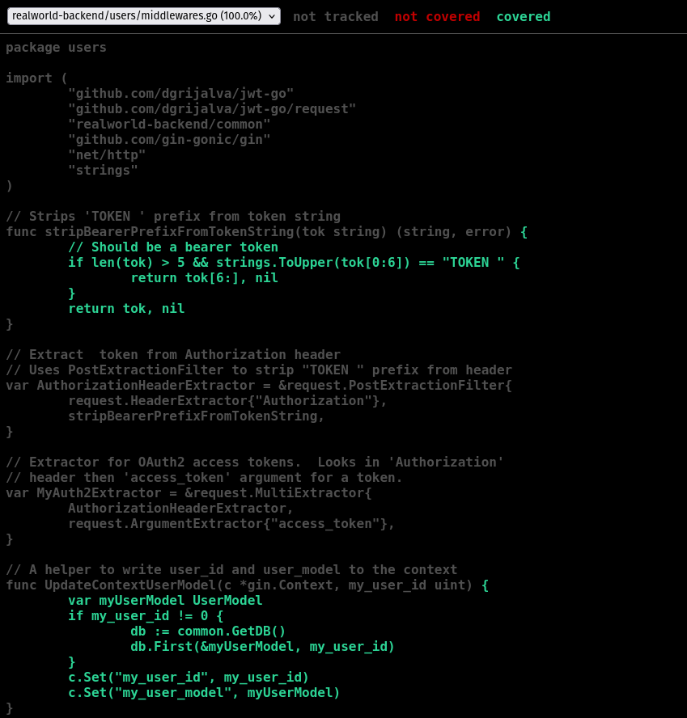
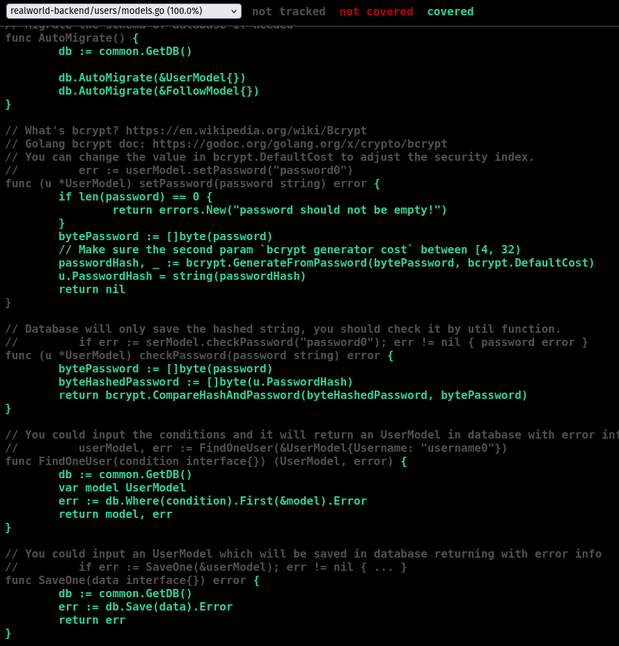
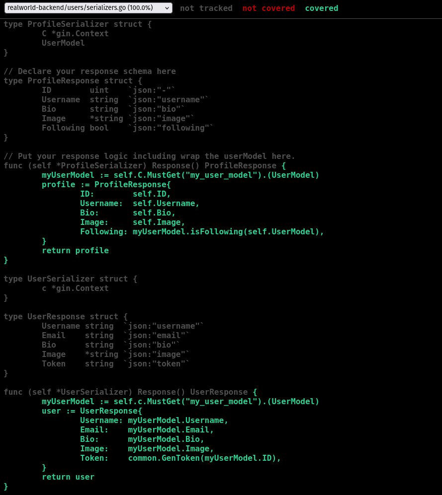

# Coverage Analysis Overview

## Summary of Current Test Coverage

### Coverage Breakdown by File

| File                 | Coverage |
| -------------------- | -------- |
| users/middlewares.go | 100%     |
| users/models.go      | 100%     |
| users/routers.go     | 100%     |
| users/serializers.go | 100%     |
| users/validators.go  | 100%     |

**Total Coverage for the `users` Module:**
You currently have **full coverage (100%)** for every file inside the `users` package.

### Coverage Snapshots

*middlewares.go*

*models.go*

*serializers.go*

---

## Coverage Observations

### Missing or Untested Logic

* **No missing tests in the `users` package:**
  Every function and block of logic in this module is covered by existing tests.

### Reason for Any Unreported Coverage

* **Other modules such as `articles` or `common` are not included in this summary.**
  This can happen when:

  * Those packages don’t have test files.
  * The coverage tool was run specifically for the `users` directory only.

### Important Areas That Require Testing (Outside `users`)

* Authentication and permission checks
* User registration & login flows
* Password hashing, validation, and security
* Database CRUD operations

---

## Plan for Enhancing Overall Coverage

### Steps to Push Total Project Coverage Above 80% (if needed)

* **Write tests for the remaining packages:**
  Add both unit and integration tests for modules like `articles`, `common`, and other core components.
* **Cover more scenarios:**
  Test failure conditions, invalid input, and security cases—especially around authentication and data handling.
* **Ensure every API route is tested:**
  Include success and failure responses for all endpoints.

### Test Cases With Strong Impact

* **Invalid or negative scenarios:**
  Wrong credentials, unauthorized requests, incorrect payloads, etc.
* **Boundary/limit conditions:**
  Long strings, missing fields, and empty request bodies.
* **Simultaneous operations:**
  Multiple users updating or creating data at once.
* **Database error scenarios:**
  Simulate failed queries or connection issues to check error handling.

---

## Next Steps

* Add testing coverage for all non-`users` packages.
* Strengthen tests that target edge cases and uncommon failure paths.
* Re-run coverage tools and refresh this report with updated metrics.
