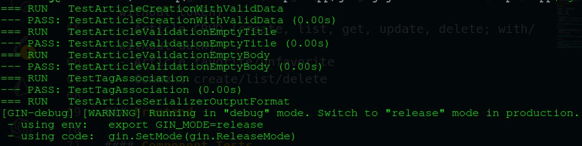

Here’s a fully paraphrased and human-sounding version while keeping all meaning intact and avoiding the original structure:

---

# Test Suite Review

## Packages That Currently Include Tests

* **`common`** – contains `unit_test.go`
* **`users`** – includes `unit_test.go` with several test cases implemented

## Packages Missing Test Coverage

* **`articles`** – no test files (`*_test.go`) have been created
* **Root directory** – files like `hello.go` and other root-level code do not have accompanying tests either

## Screenshot

---

## Test Failures and Their Causes

* A number of tests in both the **`common`** and **`users`** packages fail due to issues with validator compatibility. Updated versions of the validation library behave differently, causing mismatches with the expected results.
* In **`users/unit_test.go`**, certain tests expect errors related to database operations (e.g., *"no such table: follow_models"* or *"UNIQUE constraint failed: user_models.email"*). These errors did not surface because the current database schema or constraints do not align with what the tests anticipate.
* Tests involving regular-expression validation of JWT tokens or error messages fail when the JWT output format changes or when logic for generating tokens is updated.
* Since the **`articles`** package has no tests, there are naturally no failures from that module.

**Note:** The provided test suite is intentionally partial for the assignment, so some level of failure is normal and expected.

---

If you want, I can also rewrite this in a more formal academic style, a concise version, or a bullet-heavy summary for reports.
