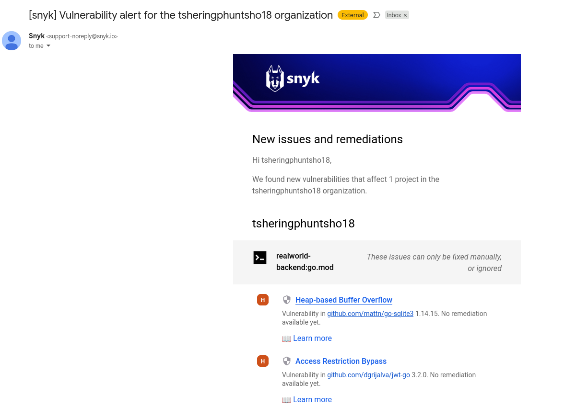

# **Vulnerability Summary**

* **Total Vulnerable Dependency Paths:** 3
* **Unique Vulnerabilities Identified:** 2
* **Severity Breakdown:**

  * **Critical:** 0
  * **High:** 3
  * **Medium:** 0
  * **Low:** 0
* **Affected Dependencies:**

  * `github.com/dgrijalva/jwt-go@3.2.0`
  * `github.com/dgrijalva/jwt-go/request@3.2.0`
  * `github.com/mattn/go-sqlite3@1.14.15` *(via `github.com/jinzhu/gorm/dialects/sqlite@1.9.16`)*

---

# **High-Severity Vulnerabilities**

## **1. Access Restriction Bypass — github.com/dgrijalva/jwt-go**

* **Severity:** High
* **Package:** `github.com/dgrijalva/jwt-go`
* **Version:** 3.2.0
* **CVE:** **CVE-2020-26160**
* **Weakness Type:** *Access Control Bypass* (CWE-287)

### **Description**

Versions of `jwt-go` up to 3.2.0 incorrectly validate JWT audience (`aud`) claims. When the `aud` field is set to an empty string slice (`[]string{}`), the library may consider the token valid even when the audience does not match and audience validation is required.

### **Attack Scenario**

An attacker can craft a JWT with an empty audience value, potentially bypassing audience validation and gaining unauthorized access to API endpoints or protected resources.

### **References**

* GitHub Issue: #422
* GitHub Pull Request: #426

### **Recommended Fix**

* Upgrade to **4.0.0-preview1** or later, **OR**
* Migrate to the actively maintained alternative: **`github.com/golang-jwt/jwt`**.

---

## **2. Heap-Based Buffer Overflow — github.com/mattn/go-sqlite3**

* **Severity:** High
* **Package:** `github.com/mattn/go-sqlite3`
* **Version:** 1.14.15
* **CVE:** **CVE-2023-7104**
* **Weakness Type:** *Heap Buffer Overflow* (CWE-122)

### **Description**

A vulnerability exists in SQLite’s session extension, specifically within the `sessionReadRecord` function (`sqlite3session.c`). Improper handling of memory can lead to a heap-based buffer overflow when processing specific crafted inputs.

### **Attack Scenario**

If user-controlled input reaches the vulnerable function, an attacker may trigger application crashes or even execute arbitrary code, depending on the deployment context.

### **References**

* Patch Commit: 9fd6f4ffd3430f64ec35c64063b59af680582e11
* SQLite Forum Report: 5bcbf4571c

### **Recommended Fix**

Upgrade to **v1.14.18** or newer.

---

# **Dependency Analysis**

### **Direct Dependencies**

* `github.com/dgrijalva/jwt-go`
* `github.com/dgrijalva/jwt-go/request`

### **Transitive Dependencies**

* `github.com/mattn/go-sqlite3` (pulled in through GORM SQLite dialect)

### **Upgrade Status**

* All vulnerable dependencies have patched versions available.
* `jwt-go` is **deprecated**; migration to `golang-jwt/jwt` is strongly recommended.

### **License Review**

* No licensing conflicts were reported by Snyk.

---

# **Summary Table**

| Vulnerability Type        | Package                     | Version | Severity | CVE            | Direct/Indirect | Recommended Fix                            |
| ------------------------- | --------------------------- | ------- | -------- | -------------- | --------------- | ------------------------------------------ |
| Access Restriction Bypass | github.com/dgrijalva/jwt-go | 3.2.0   | High     | CVE-2020-26160 | Direct          | Upgrade to 4.0.0+ or migrate to golang-jwt |
| Heap Buffer Overflow      | github.com/mattn/go-sqlite3 | 1.14.15 | High     | CVE-2023-7104  | Transitive      | Upgrade to 1.14.18+                        |

---

# **Recommended Actions**

* Migrate completely from **`dgrijalva/jwt-go` → `golang-jwt/jwt`** (actively maintained).
* Update **`go-sqlite3` to v1.14.18+** to eliminate memory corruption risks.
* Perform a full dependency audit to ensure no outdated or vulnerable transitive dependencies remain.

---

# **Screenshots**

Below are the embedded screenshots from the Snyk vulnerability scan:

