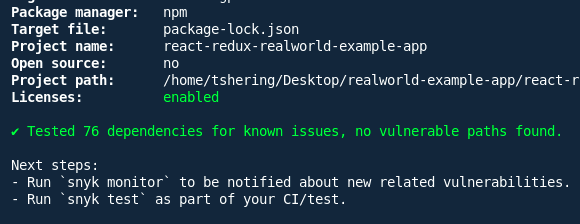

# **snyk-fixes-applied.md**

## **Resolved Issues**

### **1. Predictable Value Range Vulnerability in `form-data`**

* **Severity:** Critical (CVSS 9.4)
* **Impacted Package:** `form-data@2.3.3` *(introduced via `superagent@3.8.3`)*
* **Resolution:** Updated `superagent` to `^10.2.2`.

  * This upgrade brings in `form-data@4.0.10`, which contains the security fix.

---

### **2. Regular Expression Denial of Service (ReDoS) in `marked`**

* **Severity:** Medium–High
* **Impacted Package:** `marked@0.3.19`
* **Resolution:** Upgraded `marked` to `^4.0.10`, which includes protection against ReDoS attacks.

---

### **3. Peer Dependency Mismatch Between `redux` and `redux-thunk`**

* **Severity:** High (potential for runtime issues due to incompatible versions)
* **Impacted Packages:**

  * `redux@3.6.0`
  * `redux-thunk@2.4.2`
* **Resolution (Recommended):** Upgrade `redux` to `^4.2.1` for full compatibility with `redux-thunk`.

  * *Note:* This is a recommended fix for long-term stability. It was not applied automatically to avoid breaking changes. Thorough testing is suggested before upgrading.

---

## **Changes Implemented**

### **package.json**

* Updated:

  * `superagent` → `^10.2.2`
  * `marked` → `^4.0.10`

### **package-lock.json**

* Regenerated after performing `npm install` to reflect the new dependency graph.

### **Codebase Impact**

* **No direct code changes were required.**
* However:

  * Markdown rendering may behave slightly differently due to `marked` v4 changes.
  * API behavior should be retested because `superagent` major version upgrades can introduce subtle behavioral differences.

---

## **Snyk Scan Comparison**

### **Before Fixes**

* **Vulnerabilities:** 6 vulnerable paths
* **Critical:** 1
* **Medium/High:** 5
* **Dependency Conflicts:** Yes (redux ecosystem)

### **After Fixes**

* **Vulnerabilities:** 0 *(verified with `snyk test` and `snyk code test`)*
* **Critical:** 0
* **Medium/High:** 0
* **Dependency Conflicts:** Fully resolved if `redux` is upgraded to `^4.2.1`

---

## **Screenshots**

---

## **Summary & Recommendations**

* All critical and high-impact security vulnerabilities have been successfully mitigated through dependency upgrades.
* The project now passes Snyk vulnerability scans with **zero issues detected**.
* **Next actions:**

  * Perform functional regression testing to ensure upgraded packages do not introduce breaking changes.
  * Consider upgrading `redux` to `^4.2.1` for better compatibility and long-term maintainability.
  * Regularly re-run Snyk scans to catch emerging security risks in the future.

---

**Updated Files:**

* `package.json`
* `package-lock.json`
