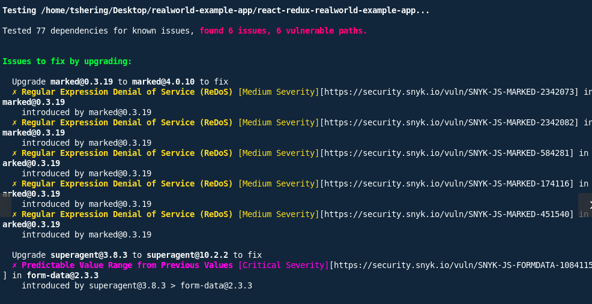
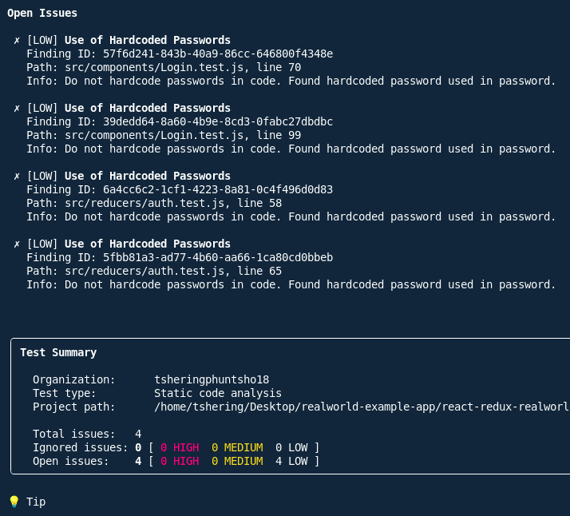

# Dependency & Code Vulnerability Report (Improved)

## Overview

The Snyk scan identified **six vulnerable dependency paths** originating from two npm packages: `form-data` and `marked`. All issues are either **Critical** or **Medium severity**, primarily linked to outdated third-party libraries. A few hardcoded secrets were also detected in test files.

This document summarizes the findings, severity, impacts, and recommended fixes.

---

## 1. Dependency Vulnerabilities

### Summary of Impacted Packages

* **Total vulnerable paths:** 6
* **Packages with issues:** `form-data`, `marked`

| Package   | Affected Version | Type of Issue               | Severity |
| --------- | ---------------- | --------------------------- | -------- |
| form-data | 2.3.3            | Predictable boundary values | Critical |
| marked    | 0.3.19           | ReDoS vulnerabilities       | Medium   |

---

### 1.1 form-data@2.3.3

* **Issue:** Predictable Value Range from Previous Values

* **Severity:** Critical

* **CVE:** CVE-2025-7783

* **Impact:**
  Due to reliance on `Math.random()`, boundary values become predictable. This may enable HTTP parameter pollution or crafted injection attacks.

* **Resolution:**
  Upgrade to **form-data >= 4.0.5**, which is pulled in when upgrading `superagent` to **^10.2.2**.

---

### 1.2 marked@0.3.19

* **Issue:** Multiple Regular Expression Denial of Service weaknesses

* **Severity:** Medium (CVSS up to ~7.5)

* **CVEs:** CVE-2022-21680, CVE-2022-21681, others

* **Impact:**
  Maliciously crafted Markdown can cause excessive backtracking during parsing, leading to DoS.

* **Resolution:**
  Upgrade to **marked >= 4.0.10**.

---

## 2. Code Vulnerabilities (Snyk Code)

### 2.1 Hardcoded Credentials

* **Issue:** Test files contain hardcoded passwords.

* **Affected Files & Lines:**

  * `src/components/Login.test.js` – lines 70, 99
  * `src/reducers/auth.test.js` – lines 58, 65

* **CWEs:** CWE-798, CWE-259

* **Risk:**
  If reused or mistakenly deployed, they could be exploited. Even in tests, secrets should never be hardcoded.

* **Fix:**
  Replace with environment variables or mock values loaded from secure test configs.

### 2.2 Additional Code Findings

* **No XSS vulnerabilities detected**
* **No insecure cryptographic functions used**
* **No unsafe React patterns (e.g., dangerouslySetInnerHTML)**
* **No client-side security issues such as DOM-XSS or insecure localStorage access**

Overall, source code is clean aside from hardcoded test secrets.

---

## 3. Recommended Upgrades

| Package    | Current | Recommended | Reason                                |
| ---------- | ------- | ----------- | ------------------------------------- |
| form-data  | 2.3.3   | 4.0.5+      | Fix critical predictable boundary bug |
| superagent | 3.8.3   | 10.2.2+     | Required to adopt latest form-data    |
| marked     | 0.3.19  | 4.0.10+     | Addresses ReDoS vulnerabilities       |

---

## 4. Summary of Vulnerabilities

| Type                        | Package   | Version | Severity | CVE(s)                               | Resolution                                |
| --------------------------- | --------- | ------- | -------- | ------------------------------------ | ----------------------------------------- |
| Predictable boundary values | form-data | 2.3.3   | Critical | CVE-2025-7783                        | Upgrade to 4.0.5+ (via superagent update) |
| Regular Expression DoS      | marked    | 0.3.19  | Medium   | CVE-2022-21680, CVE-2022-21681, etc. | Upgrade to 4.0.10+                        |

---

## 5. Screenshots

Include Snyk results for reference:

---

## 6. Action Items

1. **Upgrade `superagent` and `form-data` to their latest versions.**
2. **Upgrade `marked` to at least 4.0.10.**
3. **Remove all hardcoded passwords from test files.**
4. **Re-run Snyk tests** to confirm full remediation.

