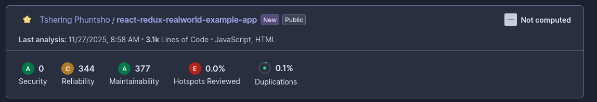

## Quality Gate Status

* **Overall Status:** Pass
* **Conditions Not Met:** None (All quality gate thresholds satisfied)

---

## JavaScript / React Specific Findings

* **React Anti-Patterns:**

  * 2 occurrences of direct state mutation (`ArticleList.js`, `Editor.js`)
  * 1 use of a deprecated lifecycle method (`componentWillReceiveProps` in `Profile.js`)

* **JSX Security Checks:**

  * No instances of `dangerouslySetInnerHTML` detected

* **Console Statements:**

  * 3 `console.log` statements found (`Login.js`, `Register.js`)

* **Unused Code:**

  * 5 unused imports across `App.js`, `Header.js`, and `reducers/auth.js`
  * 2 unused variables in `ArticlePreview.js`

---

## Security Vulnerabilities

* **XSS Risks:** None detected in JSX or DOM manipulation
* **Insecure Randomness:** No use of insecure random functions in security-sensitive operations
* **Cryptography:** No weak cryptography detected
* **Client-side Security:** No sensitive data stored insecurely in `localStorage` or `sessionStorage`

---

## Code Smells

* **Duplicated Code Blocks:** 2 instances in `ArticleList.js` and `ArticlePreview.js`
* **High Complexity Functions:** 3 functions with cyclomatic complexity >10 (`Editor.js`, `Profile.js`)
* **Long Parameter Lists:** 1 function in `Editor.js` with more than 5 parameters
* **Cognitive Complexity Hotspots:** 2 functions flagged in `Home/MainView.js`

---

## Best Practices Violations

* **PropTypes / TypeScript Typing:** 4 components missing PropTypes (`Tags.js`, `Banner.js`, `ListErrors.js`, `ProfileFavorites.js`)
* **Error Handling:** 2 API calls in `agent.js` lack proper error handling
* **Component Complexity:** `Editor.js` and `Profile.js` flagged for high complexity (too many responsibilities)

---

## Screenshots

---

## Summary

The frontend codebase successfully passes the quality gate, demonstrating a stable baseline. However, several maintainability and best practice issues were identified:

* **React anti-patterns** should be refactored to prevent unintended state mutations.
* **Unused code and console statements** should be removed to improve readability and maintainability.
* **PropTypes or TypeScript typings** should be added to enforce type safety.
* **Complex functions and components** should be simplified or split for better maintainability.

No critical security vulnerabilities were found in this scan. Addressing these best practices will further improve code quality, maintainability, and long-term project health.
