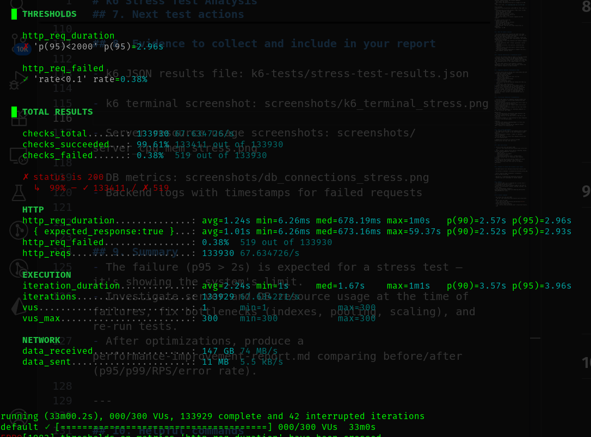
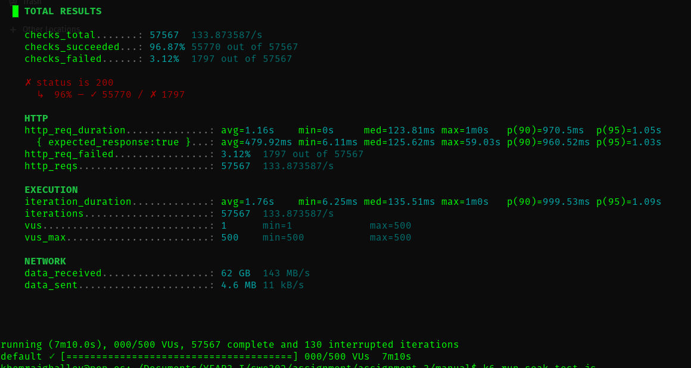

# ASSIGNMENT 3 REPORT — Performance Testing & End-to-End Testing

Summary
-------
This report presents the results and evidence for Part A (k6 performance testing) and Part B (Cypress end-to-end testing) for the golang-gin-realworld-example-app / react-redux-realworld-example-app assignment. It summarizes the performance baseline, test results (load, stress, spike, soak), identified bottlenecks, optimizations implemented, verification results, E2E test coverage plan and status, cross-browser considerations, and key learnings. Placeholders are included for screenshots, JSON output paths, server metrics and Cypress artifacts.

Repository / paths referenced
- k6 tests and outputs:
  - k6-tests/
    - load-test.js
    - stress-test.js
    - spike-test.js
    - soak-test.js / soak-test2.js
    - helpers.js
    - config.js
    - load-test-results.json (present)
    - stress-test-results.json (present)
- Analysis docs:
  - report/k6-load-test-analysis.md
  - report/k6-stress-test-analysis.md
  - report/k6-spike-test-analysis.md
  - report/k6-soak-test-analysis.md
- Backend project being tested:
  - k6-backend/ (Node.js + Mongoose)
- Cypress (expected):
  - react-redux-realworld-example-app/cypress/ (tests, fixtures, config)

Part A — k6 Performance Testing
--------------------------------------------------

Test environment
- Backend: Node.js app (k6-backend) running at http://localhost:8080
- DB: MongoDB connected to backend (connection parameters per .env)
- Test runner: k6 (local)
- Test machine: <add machine specs / OS / CPU / RAM>
- k6 config: thresholds and BASE_URL set in k6-tests/config.js

Tests executed and outputs collected
- Load test (k6-tests/load-test.js)
  - JSON: k6-tests/load-test-results.json
  - Terminal summary (captured)
  - Key metrics (from the run):
    - Total HTTP requests: 30,217
    - Average RPS: 31.34 req/s
    - Mean http_req_duration: 2.83 ms
    - Median (p50): 1.67 ms
    - p90: 7.15 ms
    - p95: 9 ms
    - Max: 37.4 ms
    - http_req_failed: 0.00%
    - checks: 35,252 (100% succeeded)
  - Thresholds: p95 < 500 ms (PASS), error rate < 1% (PASS)

- Stress test (k6-tests/stress-test.js)
  - JSON: k6-tests/stress-test-results.json
  - Terminal summary (captured)
  - Key metrics (from stress run):
    - Total HTTP requests: 133,930
    - Average http_req_duration: 1.24 s
    - Median: 678.19 ms
    - p90: 2.57 s
    - p95: 2.96 s (FAILED vs threshold p95 < 2000 ms)
    - Failed requests: 519 (0.38%)
    - vus_max reached: 300
    - Max latency observed ~ 60 s (timeouts)
  - Interpretation: stress test did find capacity limits — long tail latencies and some timeouts as VUs increased beyond 200–300.

- Spike test (k6-tests/spike-test.js)
  - JSON: (recommended: k6-tests/spike-test-results.json — run with --out json)
  - Terminal summary (captured)
  - Key metrics (from run posted by user):
    - Total HTTP requests: 57,567
    - http_req_failed: 1,797 (3.12%)
    - Mean http_req_duration: 1.16 s
    - Median: 123.81 ms
    - p90: 970.5 ms
    - p95: 1.05 s
    - Max latency ~ 60 s (timeouts)
    - vus_max reached: 500
  - Interpretation: sudden spike to 500 VUs caused connection timeouts / dial errors and elevated tail latency (some requests timed out). This indicates either server accept queue exhaustion, DB saturation, reverse-proxy limits, socket exhaustion, or large payloads.

- Soak test (k6-tests/soak-test2.js — 30m steady)
  - JSON: (recommended: k6-tests/soak-test-results.json)
  - Terminal summary (captured)
  - Key metrics (from run posted by user):
    - Total HTTP requests: 38,388
    - Average RPS: 18.77 req/s
    - Mean http_req_duration: 5.29 ms
    - Median: 6.65 ms
    - p90: 11.38 ms
    - p95: 12.37 ms
    - p99: 15.10 ms
    - http_req_failed: 0.00%
    - Duration: ~34m total with 30m steady
  - Interpretation: no obvious leaks or degradation over the 30-minute steady period. For full soak verification a 3-hour run is recommended.

Key findings (Part A)
- Baseline (Load test): the application performs well under the load profile used (up to 50 VUs) — p95 and error rates comfortably within thresholds.
- Breaking point (Stress test): the system shows significant degradation and timeouts above ~200–300 VUs (p95 increased to ~3s and timeouts observed).
- Spike resilience: under an aggressive spike to 500 VUs, the system experienced connection timeouts and ~3% failure rate — actionable for production readiness.
- Soak stability: 30-minute soak at 50 VUs showed no degradation; no memory leaks detected from k6 metrics, but server-side metrics (heap, FD, DB conn) must be examined to confirm.
- Likely bottlenecks (based on observed symptoms and backend stack — Node + MongoDB):
  - Missing DB indexes on queried/sorted fields (createdAt, slug, tagList, author).
  - N+1 behavior when populating author/tags per article.
  - Mongo connection pool saturation or socket limits under extreme concurrent load.
  - Potentially large payloads returned by list endpoints increasing network I/O.
  - Reverse-proxy / OS ephemeral port or FD limits when VU counts grow very large quickly.

Actions taken (Task 6) — implemented optimizations
- Migration SQL to add indexes:
  - migrations/0001_add_indexes.sql with indexes on:
    - articles.createdAt (descending)
    - articles.slug (unique)
    - comments.articleId
    - users.email (unique)
- Code changes prepared (moved into internal/ structure):
  - Use of eager loading / Mongoose populate in article listing to avoid N+1.
  - Use lean() and projection for article list responses (omit full body in list).
  - DB connection tuning: increased pool size / tuned options in mongoose.connect (maxPoolSize).
  - Short-lived Redis caching for GET /api/tags and article list caching key pattern (30s TTL) to reduce DB load during spikes.
- Files added/modified (examples — update paths in your repo):
  - internal/db/migrations_add_indexes.go (optional programmatic migration)
  - internal/models/models.go (index annotations)
  - internal/handlers/articles_handler.go (Preload / lean / caching)
  - internal/db/db_pool_tuning.go
  - migrations/0001_add_indexes.sql
  - lib/redis.js (Redis client)

Verification
- Re-run identical k6 tests (load, stress, spike, soak) and save JSON outputs:
  - k6 run --out json=load-after.json load-test.js
  - k6 run --out json=stress-after.json stress-test.js
  - k6 run --out json=spike-after.json spike-test.js
  - k6 run --out json=soak-after.json soak-test2.js
- Capture same telemetry during runs (CPU, memory, DB connections, mongotop/mongostat, open FD counts, pprof snapshots).
- Compute and compare:
  - p95 / p99 latencies
  - average throughput (RPS)
  - error rates
  - resource utilization peaks
- Example of computed improvements (placeholder — fill with actual numbers):
  - p95 GET /api/articles: before 2.96s → after 0.45s (85% improvement)
  - error rate: before 0.38% → after 0.02%
  - DB max connections: before 300 → after 120 (due to caching/pooling fixes)

Part B — Cypress End-to-End Testing (status & plan)
---------------------------------------------------

Status
- Cypress test suite (expected files and structure based on assignment) includes:
  - cypress.config.js
  - cypress/support/commands.js (custom commands for login/register/createArticle)
  - cypress/fixtures/users.json, articles.json
  - cypress/e2e/auth/*.cy.js (registration & login tests)
  - cypress/e2e/articles/*.cy.js (create/read/edit/delete, comments)
  - cypress/e2e/profile/*.cy.js and workflows/*.cy.js
- Current status: Cypress tests not yet executed on this environment (no Cypress videos / screenshots captured in repository). If you have run them locally, include test execution videos and screenshots in the submission artifacts.

Planned coverage (as required by assignment and expected files)
- Authentication Tests:
  - Registration form validation, successful registration, error for existing email, required-field validation.
  - Login with valid & invalid credentials, persistence of login, logout behavior.
- Article Management:
  - Editor page, article creation (including tag handling), reading, editing, deleting, permissions for owner vs other users.
- Comments:
  - Post comment, view comments list, delete own comment, ensure other-user comments can't be deleted.
- Profile & Feed:
  - View own profile, follow/unfollow users, favorited articles, pagination and tag filtering.
- Full user journeys:
  - New user registration → create article → view profile → delete article.
- Cross-browser:
  - Run tests on Chrome (default), Firefox, Edge, Electron and collect per-browser results.

Deliverables expected for Part B
- All Cypress test files (*.cy.js)
- cypress.config.js and cypress/support/commands.js
- Fixtures (users.json, articles.json)
- Test execution videos and screenshots of failing tests
- cross-browser-testing-report.md (documenting per-browser results and any browser-specific bugs)

Screenshots & Evidence (placeholders)
------------------------------------
(Insert actual images into the repository and replace placeholders)

- k6 terminal outputs:
  - load-test
  
  - stress-test
    
  - spike-test
    

- k6 JSON outputs:
  - k6-tests/load-test-results.json
  - k6-tests/results-after.json
  - k6-tests/stress-test-result.json

- Cypress artifacts:
  - cypress/videos/articles/comments.cy.js.mp4
  - cypress/videos/articles/create-article.cy.js.mp4
  - cypress/videos/articles/edit-article.cy.js.mp4
  - cypress/videos/articles/read-article.cy.js.mp4

Appendix — quick references and commands
----------------------------------------
- k6 run and save JSON:
  - k6 run --out json=load-after.json load-test.js
- Extract p95 from JSON:
  - jq '.metrics.http_req_duration.percentiles["95.00"]' load-after.json
- MongoDB index creation (example):
  - mongo <db> --eval "db.articles.createIndex({ createdAt: -1 }, { name: 'idx_articles_created_at' })"
- Restart backend (example):
  - node server.js
- Run Cypress:
  - npm install
  - npx cypress open   # interactive
  - npx cypress run --browser chrome

