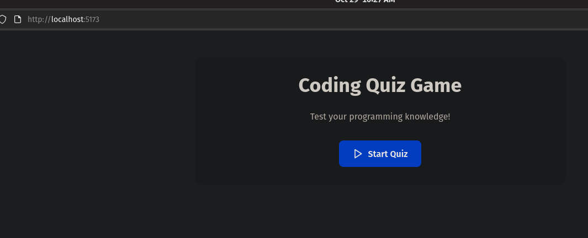
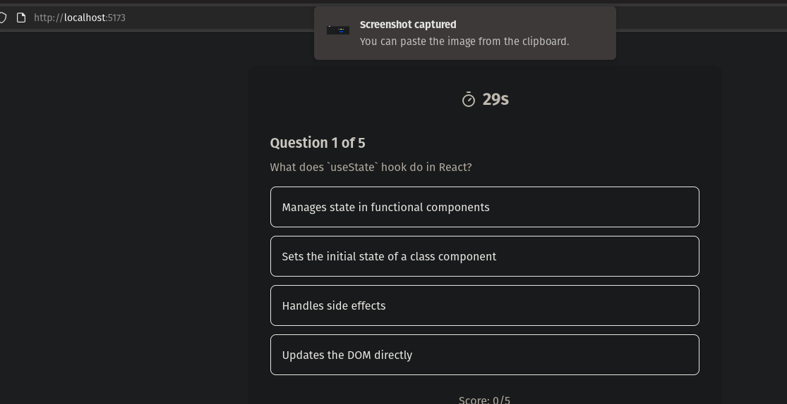
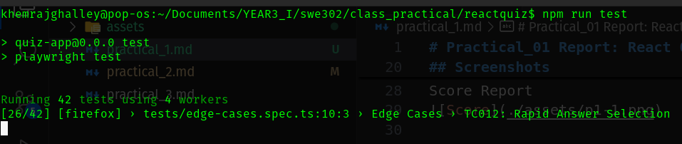
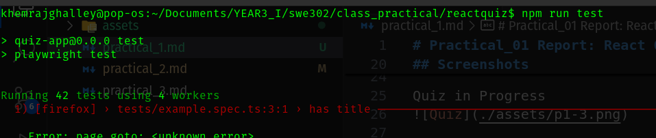
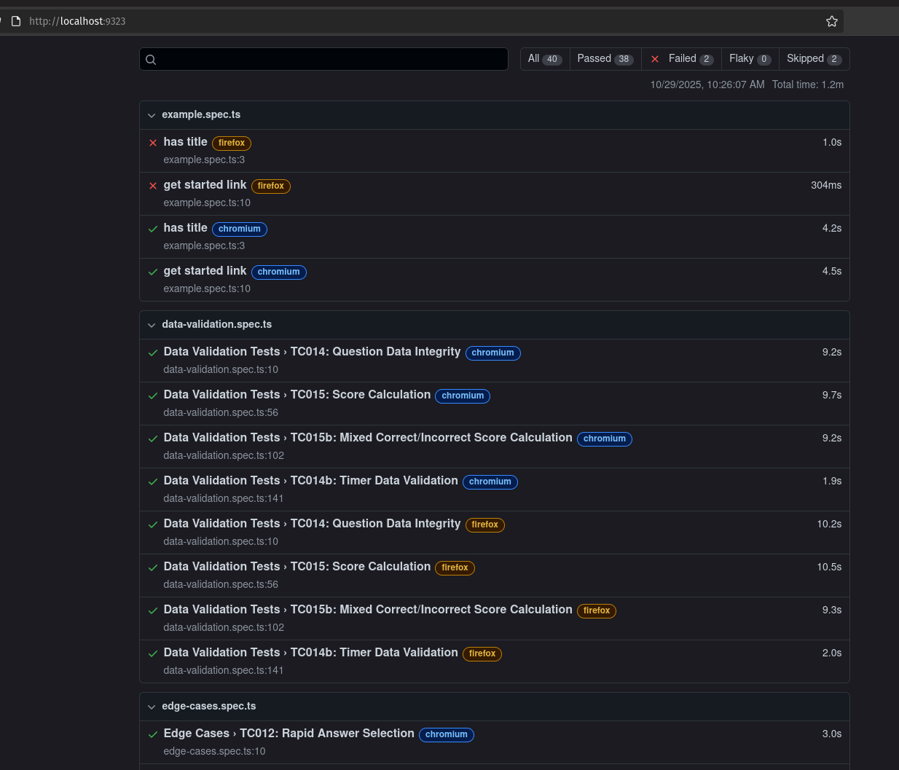

# Practical_01 Report: React Quiz Application

## Overview

This practical involves building a straightforward quiz application using React. The exercise is intended to illustrate core React concepts including component structure, managing state, passing props, and handling user events while implementing basic quiz logic.

---

## Objectives

- Build a working quiz application using React.
- Use a component-based approach to keep the code modular and reusable.
- Implement state to manage quiz flow (questions, chosen answers, scoring).
- Practice debugging and basic testing strategies.

---

## Screenshots

Start Screen
  

Quiz in Progress
 
 

Score Report 
 
 

## Challenges Faced

- Handling state transitions between questions and accounting for edge cases (for example, the final question).
- Ensuring components update and render correctly when state changes.
- Troubleshooting issues with answer selection and computing the score.
- Getting all tests to pass.

---

## Conclusion

This practical reinforced React fundamentals through hands-on implementation, emphasizing the benefits of component-driven design and careful state management. The task also underscored the importance of thorough testing and debugging to ensure reliable application behavior.

For the complete source code and more information, see the [GitHub repository](https://github.com/Khemraj9815/React-Quiz).