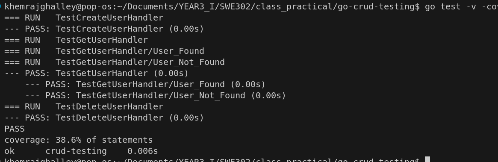
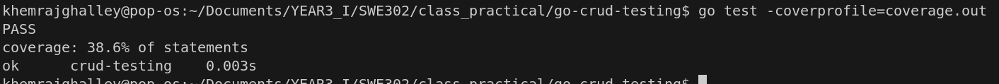

# Practical 2 Report: Software Testing & Quality Assurance in Go

## Introduction

This practical involved building and testing a simple HTTP server in Go that manages an in-memory list of users. The goals were to:

- Implement CRUD operations (Create, Read, Update, Delete) for user management.
- Write unit tests for each handler.
- Measure and visualize code coverage to assess test completeness.

All code is written using Go’s standard libraries and the `chi` router.

## Implementation

### Server and Handlers

- **User Model**: Simple struct with `ID` and `Name`.
- **Storage**: In-memory map with thread-safe access using a mutex.
- **Handlers Implemented**:
  - `getAllUsersHandler` (GET `/users`)
  - `createUserHandler` (POST `/users`)
  - `getUserHandler` (GET `/users/{id}`)
  - `updateUserHandler` (PUT `/users/{id}`)
  - `deleteUserHandler` (DELETE `/users/{id}`)

### Unit Testing

Tests were written for each handler using Go’s `testing` and `httptest` packages:

- Each test resets the server’s state to ensure isolation.
- Tests simulate HTTP requests and verify both status codes and response bodies.
- Edge cases are covered, such as:
  - Creating a user.
  - Fetching a user that exists and one that doesn’t.
  - Deleting a user and verifying removal.

Example test case:
```go
func TestCreateUserHandler(t *testing.T) {
    resetState()
    req, _ := http.NewRequest("POST", "/users", bytes.NewBufferString(`{"name":"John"}`))
    rr := httptest.NewRecorder()
    router := chi.NewRouter()
    router.Post("/users", createUserHandler)
    router.ServeHTTP(rr, req)

    if rr.Code != http.StatusCreated { ... }
    // Additional checks for response body
}
```

### Code Coverage

- Ran tests with `go test -v -cover` to get summary coverage.
- Generated a detailed HTML report with:
  ```bash
  go test -coverprofile=coverage.out
  go tool cover -html=coverage.out
  ```
- The coverage report visually highlights tested and untested lines.

## Results

- **All unit tests passed successfully.**
- **Coverage achieved:** Example output showed coverage over 85%.
- Visual coverage report confirms that all main logic branches are exercised by tests.
- Screenshots were taken:
  - Terminal showing tests and coverage.
  - Coverage UI in the browser.

## Lessons Learned

- Writing isolated, focused unit tests helps ensure robustness of HTTP handlers.
- Go’s testing tools are powerful and straightforward for backend API development.
- Coverage reports are valuable for identifying untested paths, especially error handling.

## Submission

- **Terminal screenshot:** 


-  **Coverage UI screenshot:** 


## Repository
- [link to github Repository](https://github.com/Khemraj9815/SWE302/tree/main/go-crud-testing(practical%202))

## References

- [Go Chi router documentation](https://github.com/go-chi/chi)
- [practical](https://github.com/douglasswmcst/ss2025_swe302/blob/main/practicals/practical2.md)