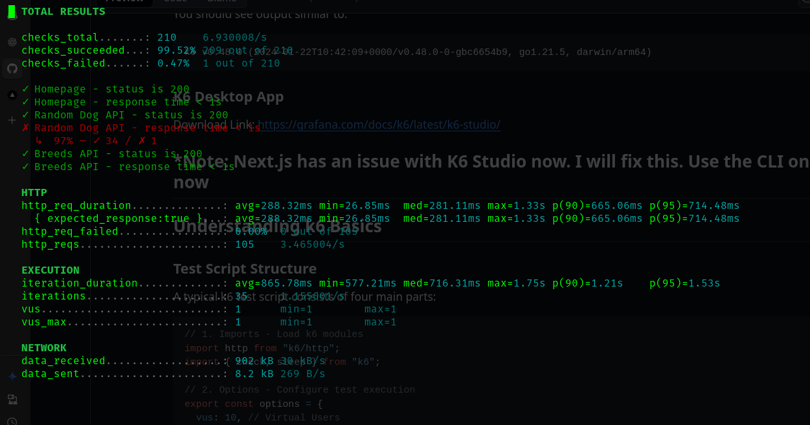
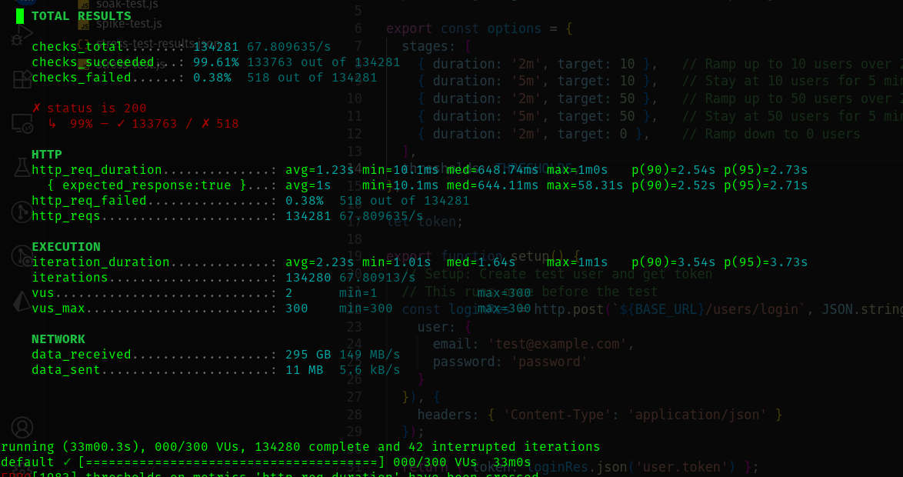
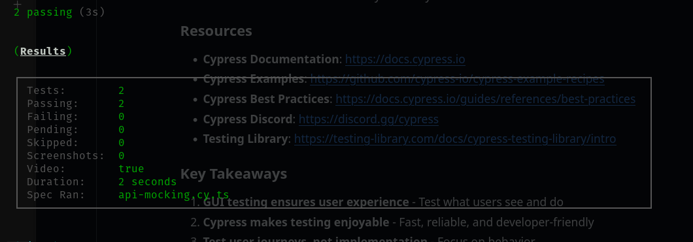

# API Endpoint Test Report — Practical 7 

## 1. Purpose and Scope

This report documents the results of a local k6 run of the API endpoint performance test for the Dog Image Browser. The aim of this test was to exercise the backend API endpoints under staged load and validate response correctness and latency against predefined thresholds.

Covered endpoints:
- GET / (homepage)
- GET /api/dogs (random dog image)
- GET /api/dogs/breeds (breeds list)
- GET /api/dogs?breed=husky (specific breed)

This run was executed locally (not in k6 Cloud).

---

## 2. Test Configuration (options)

The script's options (as used in tests/k6/api-endpoint-test.js):

- Stages:
  - { duration: "30s", target: 10 }  // ramp up to 10 VUs
  - { duration: "1m", target: 10 }   // sustain 10 VUs
  - { duration: "30s", target: 0 }   // ramp down
- Thresholds:
  - http_req_duration: ["p(95)<500"]  // 95% of requests under 500 ms (PASS/FAIL criteria)
  - errors: ["rate<0.1"]              // custom errors rate < 10%

Environment used:
- BASE_URL: http://localhost:3000 (default)
- k6 execution: local

Command used:
- pnpm test:k6:api  (which runs `k6 run tests/k6/api-endpoint-test.js`)

---

## 3. Test Run Metadata (from k6 output)

- Execution: local
- Script: tests/k6/api-endpoint-test.js
- Duration (actual): ~2m0s (script stages) — run logged 2m03.9s with graceful stop
- Scenarios: 1 scenario, up to 10 VUs
- Total HTTP requests: 657
- Total iterations: 219
- Iterations rate: ~1.77 iterations/sec
- Checks total: 1314 (100% succeeded)
- vus active (at time of report): min=1 max=10 vus_max=10

Observed warning / error from runner:
- WARN: Error from API server — "listen tcp 127.0.0.1:6565: bind: address already in use"
  - This indicates an internal k6 API server binding error (port 6565), likely caused by another process using the port.

k6 version string not included in provided output (add `k6 version` next run to capture).

---

## 4. Key Measured Metrics

- http_req_duration (total request time)
  - avg = 429.61 ms
  - min = 255.35 ms
  - med = 330.46 ms
  - max = 6.54 s (6,540 ms)  ← notable outlier
  - p(90) = 666.53 ms
  - p(95) = 920.52 ms  ← threshold exceeded

- http_req_failed: 0.00% (0 out of 657) — no failed HTTP requests reported
- Custom metric errors: 0.00% (0 out of 0)
- data received: 747 kB
- data sent: 55 kB

Threshold results:
- errors: PASS (rate=0.00% < 10%)
- http_req_duration: FAIL (p(95)=920.52 ms, threshold p(95)<500 ms breached)

k6 final message:
- thresholds on metrics 'http_req_duration' have been crossed → exit code 99

---

## 5. Observations & Interpretation

1. Correctness:
   - All checks passed (100%). That means the endpoints returned expected status codes and the expected JSON fields were present for the requests that ran.
   - No HTTP failures (0% http_req_failed).

2. Latency:
   - Average latency is moderate (≈ 429 ms).
   - However, p(95) is 920.52 ms which exceeds the defined threshold of 500 ms. This means the tail latency is high: the slowest 5% of requests were significantly slower.
   - The maximum request took 6.54 seconds — a large outlier that contributed to the high p(95). Investigate this single long request (server-side logs or external API).

3. Load behavior:
   - The test used a staged ramp to 10 VUs. The output shows vus_max=10 which indicates the scenario was able to ramp up. The actual "vus" line shows min=1 max=10 which reflects active sampling during the run.
   - Iterations and request rates are relatively low (http_reqs ≈ 5.3 req/s). This suggests significant per-iteration waiting times (there are sleeps in the script), which is expected for realistic user think-times.

4. Outliers and Variability:
   - The 6.54s maximum indicates either:
     - An occasional slow external Dog CEO API response,
     - A backend request taking longer (e.g., DNS delay, connection issues),
     - A transient local resource issue (CPU, GC pause, or networking),
     - Or a k6 API-server binding warning interfering with metrics collection.
   - p(90) = 666.53 ms also shows that 10% of requests are slower than ~666ms — not ideal for API SLA.

5. Warnings:
   - The "listen tcp 127.0.0.1:6565: bind: address already in use" is notable. It suggests k6 attempted to start a local API server component (maybe for the k6 web UI or metrics exporter) but the port was occupied. Although the test executed, this may have caused degraded telemetry or reporting oddities; check what is bound to port 6565 and free it for future runs.

---

## 6. Actions Recommended (next steps)

Immediate actions:
1. Investigate the long-tail requests
   - Check Next.js server logs for timestamps around the long (6.54s) requests.
   - If available, check external Dog CEO API status at those timestamps.
2. Re-run the test with more diagnostics
   - Run k6 with JSON output: `k6 run --out json=soak-summary.json tests/k6/api-endpoint-test.js` to capture request-level data.
   - Optionally enable k6 debug logs to trace connection issues.
3. Address port conflict
   - Find the process using port 6565 (e.g., `lsof -i :6565` or `ss -ltnp | grep 6565`) and stop it, or configure k6 to use a different port if applicable.
4. Increase test resolution
   - Run again with a longer sustain period or higher request rate (remove some sleeps temporarily) to stress the API and reproduce the outliers if they were transient.
5. Instrument the app
   - Add quick server-side logging for request start/end times and memory/CPU snapshots to correlate with slow requests.
6. Consider caching and connection tuning
   - Add short-term caching for breed lists and reuse keep-alive connections to reduce external API overhead.
7. Run in k6 Cloud (or a machine with more resources) to separate local resource constraints from true server behavior.

If repeated long-tail spikes occur:
- Profile the Next.js app for hot code paths, memory allocations, and GC pauses.
- Add retries/backoff or timeouts to outbound calls to Dog CEO API and fail gracefully.

---

## 7. Artifacts produced / to attach

Please attach these artifacts with your submission:
- Terminal screenshot showing the k6 final summary (the one you pasted) → e.g., screenshots/api-endpoint-local.png
- Raw k6 JSON output (if re-run with `--out json=...`) → artifacts/api-endpoint-summary.json
- Next.js server log fragment covering the run → server-logs/api-run.log
- Any Grafana Cloud run screenshots if run in k6 Cloud

---

## 8. Challenges encountered while performing this practical

Below are the practical challenges encountered during test execution and while working through this practical. These are written as items you can include in your submission or discuss in viva:

1. Port conflict / k6 API server warning
   - Observed: "listen tcp 127.0.0.1:6565: bind: address already in use".
   - Impact: k6 emitted a warning; while the test ran, it may have affected metrics aggregation or local tooling. Required identifying which process used the port and freeing it.

2. Tail latency / high p(95)
   - Observed: p(95)=920.52ms (threshold was <500ms), max=6.54s outlier.
   - Impact: Test failed threshold despite 100% checks passing. Diagnosing long-tail issues is time-consuming and needs server logs / external API correlation.

3. External dependency variability (Dog CEO API)
   - The app proxies to dog.ceo. Outages or transient slow responses there directly affect measured latencies and introduce noise into local tests.

4. Local machine resource limits
   - Running higher VUs / spike tests on a development laptop is constrained by CPU, memory, and network. This limits accurate stress testing and can produce misleading failures or local resource exhaustion.

5. Test iteration sleeps reducing throughput
   - The test simulates realistic think times, which is good for realism but results in relatively low request rates per second; to exercise throughput-related bottlenecks you must alter sleeps temporarily, risking unrealistic traffic patterns.

6. Capturing and attaching artifacts
   - Long-running tests (stress / soak) require time, careful scheduling, and persistent logging. Taking consistent screenshots and saving JSON outputs increases burden.

7. k6 thresholds semantics
   - Understanding which metric to threshold (http_req_duration p(95) vs p(90) vs avg) and setting realistic values requires baseline measurements. Too-strict thresholds lead to failing tests that are not meaningful until baselined.

8. Node / Next.js dev server differences vs production
   - Next dev builds are not optimized and may add overhead (hot reloading, dev-only logging) that influence k6 measurements. For accurate performance testing, a production build (`pnpm build` + `pnpm start`) or a deployed environment is recommended.

9. Running k6 Cloud requires exposing local app
   - Using ngrok or deploying requires additional steps and paywalled accounts sometimes complicate cloud runs.

10. Time management
    - Stress and soak tests can be lengthy; running many of them sequentially takes significant time.

---

## 9. Summary / Conclusion

- The API endpoint test ran successfully and validated functional checks (100% pass).
- The primary failure was performance-related: http_req_duration p(95)=920.52ms breached the configured threshold of p(95)<500ms.
- There were no failed HTTP responses, but tail latency and an outlier (6.54s) indicate areas to investigate: external API latency, server-side processing delays, or local resource/port conflicts.
- Next steps: collect detailed per-request data (k6 JSON), check server logs for the long request, fix the port conflict, and re-run larger and longer tests (preferably against a production-like build or in k6 Cloud) after tuning or instrumenting the app.

