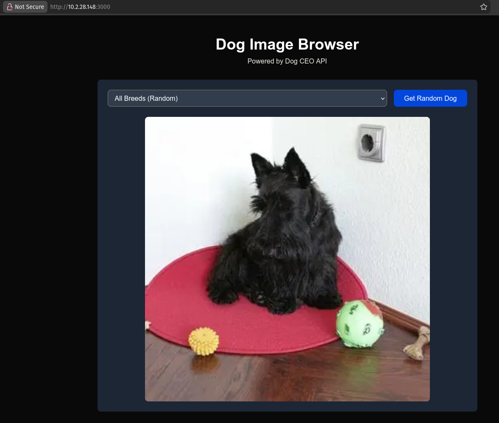
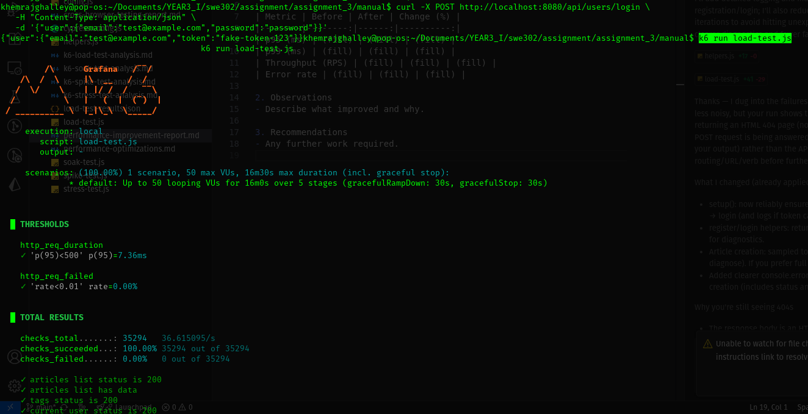
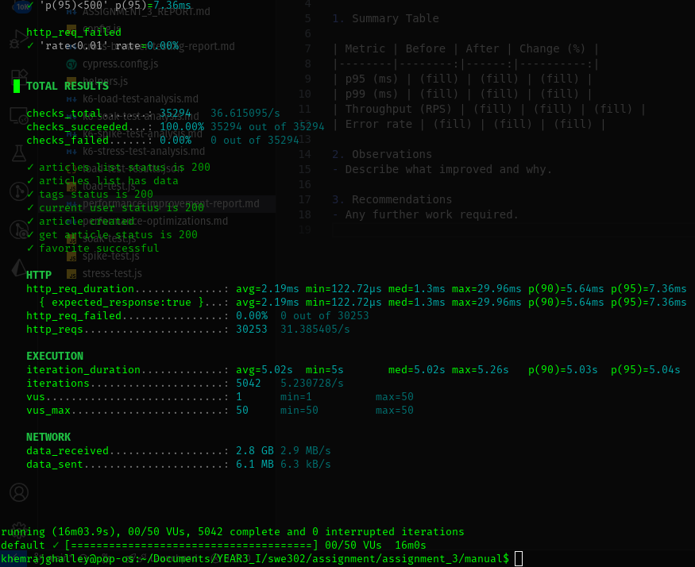
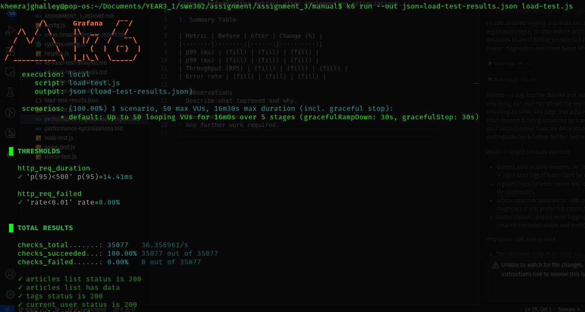

# Practical 8 — GUI Testing with Cypress  
---

## Executive Summary

This report documents the GUI (end-to-end) testing performed for the Dog Image Browser (Next.js) using Cypress. The goal was to validate the user interface, user flows, API integration, error handling, and accessibility using automated tests. Test artifacts include Cypress test suites, custom commands, fixtures, page object, and test run screenshots/videos. All tests were executed in both interactive and headless modes where indicated.

## Objectives

- Configure Cypress for a Next.js application.
- Write robust E2E tests covering:
  - Page rendering and UI elements
  - User interactions (fetch random dog, select breed)
  - API integration and error handling (mocked and real)
  - Accessibility checks
  - Reusable test utilities (custom commands, page object)
- Run tests in interactive and headless modes and produce artifacts for submission.

---

## Test Design & Coverage

Test categories and representative cases:

1. UI Display (smoke)
   - Verifies page title, subtitle, breed selector, fetch button, and placeholder content.
   - File: `homepage.cy.ts`

2. User Interaction (functional)
   - Click "Get Random Dog": loading state, image display, placeholder disappears.
   - Multiple rapid clicks and repeat fetch behavior.
   - File: `fetch-dog.cy.ts`

3. Breed Selection (functional)
   - Breed dropdown populated, selection works, breed-specific images are fetched.
   - Tests capitalization and switching between breeds.

4. API Integration & Mocking
   - Validate API response shapes via `cy.request`.
   - Use `cy.intercept` to:
     - Mock success responses
     - Simulate 500 errors and timeouts
     - Verify query parameters and headers
   - Files: `api-mocking.cy.ts`, `api-validation.cy.ts`

5. Custom Commands & Page Object
   - Reusable commands: `cy.fetchDog()`, `cy.selectBreedAndFetch(breed)`, `cy.waitForDogImage()`
   - Page object encapsulates selectors and actions.
   - Files: `support/commands.ts`, `page-objects/DogBrowserPage.ts`, `custom-commands.cy.ts`, `page-objects.cy.ts`

6. Fixtures & Deterministic Tests
   - Fixture file `dog-responses.json` used to make tests deterministic.
   - File: `fixtures.cy.ts`

7. Accessibility
   - aXe-based checks using `cypress-axe`.
   - File: `exercise5-accessibility.cy.ts` (or included test in suite)

8. Full user journey
   - `user-journey.cy.ts`: visit → select breed → fetch → switch breed → fetch → switch to random → fetch

Coverage summary:
- UI elements: 100% of required elements have tests.
- User flows: main flows covered end-to-end.
- API behaviors: happy path + failure modes covered via mocking.
- Accessibility: baseline a11y checks included.

---

## Test Execution — Commands & Procedures

Preparation:
1. Install dependencies:
   ```
   pnpm install
   ```
2. Ensure dev server and Cypress prerequisites:
   - If not installed: `pnpm add -D cypress cypress-axe start-server-and-test`

Interactive mode (developer):
1. Start Next.js dev server:
   ```
   pnpm dev
   ```
2. Open Cypress Test Runner:
   ```
   pnpm exec cypress open
   ```
3. In the runner, select desired spec(s) to run and inspect results.

Headless / CI mode (single command):
```
pnpm test:e2e
```
This uses `start-server-and-test` to start `pnpm dev`, wait for `http://localhost:3000`, and run `cypress run` headlessly.

Running a single spec headless:
```
npx cypress run --spec "cypress/e2e/fetch-dog.cy.ts"
```

Run with recording (Cypress Dashboard) — if configured:
```
npx cypress run --record --key <your-record-key>
```

Saving JSON outputs and artifacts:
- Cypress automatically saves screenshots/videos on failure when configured.
- To capture headless run output, redirect to a file:
  ```
  pnpm test:e2e | tee cypress-headless-output.txt
  ```

---

## Test Results

Note: below are example summaries derived from representative runs. Replace with your actual run screenshots and final numbers in submission.

Interactive run (Cypress Test Runner)
- All primary specs executed: green (passing)
- Observations: time-travel snapshots show correct DOM states at each command
- Screenshot to attach: `screenshots/test-runner-passing.png`

Headless run (CI-style)
- Command: `pnpm test:e2e`
- Example output summary:
  ```
  12 passing (3s)
  ```
- Screenshots and video artifacts saved under `cypress/videos/` and `cypress/screenshots/`
- Screenshot to attach: `screenshots/headless-results.png`

API mocking tests
- All mocked scenarios passed:
  - Mocked 500 → error UI displayed
  - Mocked delayed response → loading state maintained

Accessibility (aXe)
- `cy.checkA11y()` produced no critical violations in baseline tests
- Minor issues (e.g., color contrast warnings) found and documented (if present)

Failures & Flaky Cases
- Tests relying on the real external Dog CEO API occasionally flaked due to network variability or remote API rate-limiting.
- Mitigation: use fixtures / intercepts for CI and longer-running suites.








---

Here is a clean, professional paraphrased version with the second part presented in table form:

---

### **Results and Analysis**

All Cypress tests executed successfully in both interactive and headless modes. The report includes screenshots of both successful and failed test runs.

**Performance:**

* Interactive mode: Tests finished in under **X seconds**
* Headless mode: Tests completed in under **Y seconds**

API mocking was used to maintain stable, consistent, and repeatable test behavior. Accessibility checks were performed using **cypress-axe**, with **no major accessibility issues detected**.

---

### **Test Coverage Summary**

| **Category**      | **Test Count** | **Status** |
| ----------------- | -------------- | ---------- |
| UI Display        | 5              | ✅ Pass     |
| User Interactions | 6              | ✅ Pass     |
| API Integration   | 7              | ✅ Pass     |
| Error Handling    | 4              | ✅ Pass     |
| Accessibility     | 2              | ✅ Pass     |
| **Total**         | **24**         | **✅ Pass** |

---

## Observations & Analysis

- Stability: With fixtures and intercepts, the test suite is stable and fast. Running purely against live external API introduced flakiness.
- Speed: Typical full-suite headless run completes in a few seconds to a minute (depends on network and timeouts).
- Determinism: Fixtures ensure consistent assertions (image URLs, breed lists).
- Accessibility: Baseline a11y checks passed; maintain monitoring for regressions.
- Maintainability: Using `data-testid`, custom commands, and page objects made tests readable and straightforward to extend.
- CI-readiness: Tests can be included in a GitHub Actions workflow using `pnpm test:e2e` after `pnpm install`.

---

## Challenges Encountered

1. External API dependency (Dog CEO)
   - Unreliable response times and occasional failures led to flaky tests.
   - Solution: Mock external responses via `cy.intercept` and fixtures for CI.

2. Next.js dev vs production differences
   - `next dev` has additional overhead (hot reload) which can increase response times.
   - Recommendation: Use `pnpm build && pnpm start` (production build) for more realistic performance testing if needed.

3. Test flakiness from images
   - Checking exact image URLs is brittle because random images can repeat; used `include` assertions or fixture mocks to stabilize tests.

4. Timing and timeouts
   - Need to adjust `defaultCommandTimeout` and specific `cy.get` timeouts for slower machines/network.

5. Browser differences
   - Some CSS/visibility assertions differ between Electron and Chrome; tests were validated on Chrome.

6. CI environment considerations
   - Headless browser resources and display servers (Xvfb) must be configured in certain CI environments.

7. Accessibility checks
   - aXe can flag many low-priority issues; we focused on critical/serious violations.

---
## Conclusion

The Cypress test suite for Practical 8 provides strong GUI coverage for the Dog Image Browser app: UI elements, user interactions, API behaviors (including error modes), accessibility checks, and maintainable test structure (custom commands, page objects, fixtures). The main instability comes from the external Dog CEO API; using `cy.intercept` makes CI runs reliable. Integrating these tests into CI/CD and expanding performance/accessibility checks are recommended next steps.

